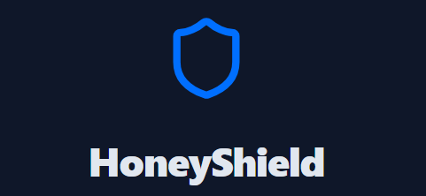

<div align="center">
  
<h1 align="center">
    
</h1>
  
  

  <h1>Advanced web honeypot system for intrusion detection and threat analysis</h1>
  
  <p>
  Welcome to HoneyShield — Your First Line of Deceptive Defense.
Discover, deceive, and detect. HoneyShield creates realistic traps to lure attackers, analyze their methods, and help you stay one step ahead in securing your web applications.</p>
  
  
<!-- Badges -->
<p>
  <a href="https://github.com/Raouf-Braham/HoneyShield/graphs/contributors">
    
  </a>
  <a href="">
    
  </a>
  <a href="https://github.com/Raouf-Braham/StylishYou/network/members">
    
  </a>
  <a href="https://github.com/Raouf-Braham/StylishYou">
    
  </a>
  <a href="https://github.com/Raouf-Braham/StylishYou/issues/">
    
  </a>
  <a href="https://github.com/Raouf-Braham/StylishYou/blob/master/LICENSE">
    
  </a>
</p>
   
<h4>
    <a href="https://github.com/Raouf-Braham/StylishYou">Documentation</a>
  <span> · </span>
    <a href="https://github.com/Raouf-Braham/StylishYou/issues/">Report Bug</a>
  <span> · </span>
    <a href="https://github.com/Raouf-Braham/StylishYou/issues/">Request Feature</a>
  </h4>
</div>

<br />

<!-- Table of Contents -->
# Table of Contents

- [About the Project](#about-the-project)
  * [Mission](#mission)
  * [Tutorial](#tutorial)
  * [Tech Stack](#tech-stack)
  * [Features](#features)
  * [Color Reference](#color-reference)
- [Getting Started](#getting-started)
  * [Run Locally](#run-locally)
- [Usage](#usage)
- [Roadmap](#roadmap)
- [Contributing](#contributing)
  * [Code of Conduct](#code-of-conduct)
- [License](#license)
- [Contact](#contact)
- [Acknowledgements](#acknowledgements)
  

<!-- About the Project -->
## About the Project

<!-- Mission -->
### Mission
To provide a **deceptive and data-rich honeypot system** that helps security researchers and developers detect, understand, and respond to web-based attack attempts in a safe environment.

<!-- Tutorial -->
### Tutorial

<p>New to HoneyShield? Here's how to get started:

1. Launch HoneyShield via http://localhost:5000.

2. Homepage gives an overview and links to all honeypot features.

3. Dashboard displays attack stats, patterns, and detailed logs.

4. Admin Login Page is a fake login form to detect unauthorized access.

5. Search Page detects SQLi and XSS attempts.

6. Hidden Paths like /backup.sql log stealthy access attempts.
</p>
<br>

https://github.com/user-attachments/assets/6c08f287-4ade-4eb8-bcee-777adc5163ba

<!-- TechStack -->
### Tech Stack

This project is built with:

- Vite
- TypeScript
- React
- shadcn-ui
- Tailwind CSS

<!-- Features -->
### Features

- 🎯 Fake admin login page honeypot
- 🕷 Hidden paths like `/backup.sql`, `/admin123`, etc.
- 🔍 XSS and SQLi detection on search inputs
- 📊 Real-time dashboard with charts and stats
- 📁 Attack detail logs with IP, timestamp, type, and payload
- 🔔 Alert visualization on recent threats
- 🔐 Simulated vulnerability endpoints

<!-- Color Reference -->
### Color Reference

| Color        | Hex       |
|--------------|-----------|
| Primary Blue | `#007BFF` |
| Alert Red    | `#DC3545` |
| Background   | `#1E1E2F` |
| Text Light   | `#F8F9FA` |


<!-- Getting Started -->
## Getting Started

<!-- Run Locally -->
### Run Locally

If you want to work locally using your own IDE, you can clone this repo and push changes. Pushed changes will also be reflected in Lovable.

The only requirement is having Node.js & npm installed - [install with nvm](https://github.com/nvm-sh/nvm#installing-and-updating)

Follow these steps:

```sh
# Step 1: Clone the repository using the project's Git URL.
git clone https://github.com/Raouf-Braham/HoneyShield.git

# Step 2: Navigate to the project directory.
cd HoneyShield

# Step 3: Install the necessary dependencies.
npm i

# Step 4: Start the development server with auto-reloading and an instant preview.
npm run dev
```
<!-- Usage -->
## Usage

🔹 Step 1: Explore the Homepage
The homepage provides an overview of the honeypot and a button to "View Dashboard" for real-time monitoring.

🔹 Step 2: View the Dashboard
Click "View Dashboard" to open the main interface:

📊 Real-time attack statistics

⏱ Timeline of attack attempts

📍 List of active honeypot endpoints

📂 Detailed logs of every attack

Click on any attack entry to view:

IP address

Payload or vector

Type of attack (e.g., SQLi, XSS)

Timestamp

🔹 Step 3: Test the Admin Login Honeypot
Click "Admin Login" to open a fake login form.

Any login attempt is flagged and recorded.

Useful for detecting brute-force or credential stuffing behavior.

🔹 Step 4: Trigger the Search Honeypot
Navigate to the Search Page.

Try submitting inputs like <script>alert(1)</script> or ' OR 1=1 -- to simulate attacks.

These inputs are logged as potential XSS or SQLi attempts.

🔹 Step 5: Access Hidden Traps
Manually visit known fake paths like:

/backup.sql

/admin123

/oldpanel

These endpoints do not show UI content, but silently log access attempts.

<!-- Roadmap -->
## Roadmap
 • Exportable attack logs (CSV, JSON)

 • Email alert system

 • Geo-IP map for attacker locations

 • Admin panel authentication

 • Deploy to cloud (Docker/VPS)

<!-- Contributing -->
## Contributing

Contributions are always welcome!

See `contributing.md` for ways to get started.


<!-- Code of Conduct -->
### Code of Conduct

Please read the [Code of Conduct](https://github.com/Raouf-Braham/HoneyShield/blob/master/CODE_OF_CONDUCT.md)

<!-- License -->
## License

Distributed under the no License. See LICENSE.txt for more information.


<!-- Contact -->
## Contact

Linkedin - [@Raouf Braham](https://www.linkedin.com/in/raouf-braham-67b365251/) | Email - raouf.brahem@eniso.u-sousse.tn

Project Link: [https://github.com/Raouf-Braham/StylishYou](https://github.com/Raouf-Braham/WebScanPro)


<!-- Acknowledgments -->
## Acknowledgements

• MongoDB — Database for storing logs

• Plotly / Chart.js — Optional charting libraries

• Inspired by modern honeypot practices

• All contributors and testers
